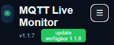

# MQTT Live Monitor

Ein einfacher Web-Monitor für MQTT-Nachrichten mit Live-Ansicht, Filter, Detailansicht und decodierten Daten (z. B. ChirpStack).

---

## ⚡ Quick Start
Git installieren, wenn nicht vorhanden
```bash
apt install -y git
```
Repository klonen
```bash
git clone https://github.com/BenAhrdt/mqtt-live-monitor.git
```
In das Verzeichnis des mqtt-live-monitors wechseln
```bash
cd mqtt-live-monitor
```
Installationsscript aufrufen
```bash
bash install.sh
```
---

## 🚀 Installation (Details)

Das Installations-Skript übernimmt automatisch:

- Installation von Node.js / npm
- Installation von git (falls nicht vorhanden)
- Installation aller Abhängigkeiten (npm install)
- Einrichtung als systemd Service
- automatischer Start beim Systemstart

---

Installationsscript aufrufen
```bash
bash install.sh
```
---

## 🚀 Update

Komforatebl über den Webserver.
Wird eine neue Version online erkannt, so wird dies angezeigt.
Durch einen Klick auf den Button und bestätigen, wird ein Update durchgeführt.
Ein Reload der Seite erfolgt nach dem update. 


Das Updatescript (sofern schon vorhanden) übernimmt automatisch das update

```bash
cd /opt/mqtt-live-monitor
sudo bash update.sh
```

Sollte noch keine update.sh vorhanden sein, dann folgernde Befehle ausführen:

```bash
cd /opt/mqtt-live-monitor
cp config.json /root/config.json.backup
git fetch --all --tags
git checkout -f main
git reset --hard origin/main
cp /root/config.json.backup config.json
npm install --omit=dev
systemctl daemon-reload
systemctl restart mqtt-live-monitor
```
---

## 🌐 Zugriff

Nach der Installation erreichst du die Weboberfläche unter:

http://<IP-DEINES-SERVERS>:3000

Beispiel:

http://192.168.1.100:3000

---

## 🔧 Service verwalten

Status anzeigen:

systemctl status mqtt-live-monitor

Neustarten:

systemctl restart mqtt-live-monitor

Stoppen:

systemctl stop mqtt-live-monitor

Logs anzeigen:

journalctl -u mqtt-live-monitor -f

---

## Changelog

### V1.2.6 Pending logging
* (BenAhrdt) logging für topics die aufgrund von discovery aus dem pending gelöscht wurden

### V1.2.5 Apply Pending messages in den nächsten Event-Loop gelegt.
* (BenAhrdt) verzögerung eingebaut (0ms), damit apply pending Messages erst im nächsten EventLoop erledigt wird

### V1.2.4 Pending states löschen
* (BenAhrdt) Alle Pending states, die älter als 5min sind, oder wenn es mehr als 1000 sind, werden gelöscht.

### V1.2.3 Namensdarstellung umbenannte Geräte erweitert
* (BenAhrdt) Darstellen von originalnamen bei umbenannten Geräten.

### V1.2.2 Bessere Live Message Anzeige
* (BenAhrdt) Live Monitor speichert nun eine Anzahl x (konfigurierbar) Werte im Backend zur besseren Anzeige im Filter-Frontend

### V1.2.1 Merge Import
* (BenAhrdt) Bearbeiten korrigiert, Merge bei Import

### V1.2.0 Smarte Funktionen
* (BenAhrdt) Auslagerung der Funktionen in einzelne Dateien
* (BenAhrdt) Brokerkonfiguration in Einstellungen gebracht
* (BenAhrdt) Einführung der friendlyNames für Geräte und Entitäten
* (BenAhrdt) Drag & Drop für Reihenfolge in de Custom Dashboards

### V1.1.11 Eigene Dashboards
* (BenAhrdt) Anlegen von Dashboards mit eigens ausgewählten Geräten / Entitäten

### V1.1.10 passwort verbergen
* (BenAhrdt) verbesserte Passwortbehandlung

### V1.1.9 Verbesserungen in der UI / Konfiguration
* (BenAhrdt) Einstellungssteite für Device Prefixe aktiviert

### V1.1.8 Reload nach update / Zusätzliche Entitätstypen hinzugefügt
* (BenAhrdt) nach dem update erfolgt ein reload der Seite
* (BenAhrdt) binary_sensor
* (BenAhrdt) switch
* (BenAhrdt) button
* (BenAhrdt) alphabetische Sortierung der Geräte
* (BenAhrdt) number
* (BenAhrdt) slider korrigiert
* (BenAhrdt) bessere Bedienung durch einzelne Entitätsupdates statt dashboard render
* (BenAhrdt) text
* (BenAhrdt) entitäten können auf dem Dashboard auch durch unterordner und komma getrennt angezeigt werden.
             Bspw. YourIP:Port/dashboard/light,cover,number

### V1.1.7 Pending States
* (BenAhrdt) Retaindaten von states, die vor der discovery rein kommen, werden beachtet

### V1.1.6 Nachkommastellen
* (BenAhrdt) Logik für Nachkommastellen eingebaut

### V1.1.5 Update Test
* (BenAhrdt) Test für Update Script

### V1.1.4 Sensor als Entität hinzugefügt
* (BenAhrdt) Der Entitätstyp sensor, wurde hinzugefügt

### V1.1.3 Icon
* (BenAhrdt) icon hinzugefügt

### V1.1.2 Korrektur im Update Verhalten
* (BenAhrdt) update skript verändert


### V1.1.1 Updatefähig
* (BenAhrdt) Coder updatefägi durch button (erster Test)

### V1.1.0 Einige Entitäten verfügbar

## 📦 Voraussetzungen

- Debian / Ubuntu (z. B. LXC Container)
- Root-Rechte für Installation

---

## 📄 Lizenz

Dieses Projekt steht unter der MIT-Lizenz.

Das bedeutet:

- freie Nutzung
- freie Weitergabe
- auch kommerziell nutzbar

Ohne Gewährleistung oder Haftung.