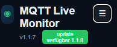
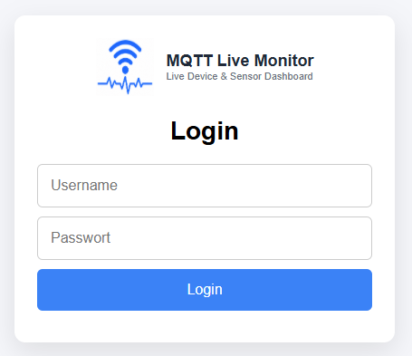

# MQTT Live Monitor

Ein einfacher Web-Monitor für MQTT-Nachrichten mit Live-Ansicht, Filter, Detailansicht und decodierten Daten (z. B. ChirpStack).

---

## ⚡ Quick Start
Git installieren, wenn nicht vorhanden
```bash
apt install -y git
```
Repository klonen
```bash
git clone https://github.com/BenAhrdt/mqtt-live-monitor.git
```
In das Verzeichnis des mqtt-live-monitors wechseln
```bash
cd mqtt-live-monitor
```
Umgebungsvariablen anlegen
```bash
nano .env
```
Inhalt der Datei:
```bash
SESSION_SECRET=irgendeinLangesGeheimesSecret
USE_HTTPS=false
RATE_LIMIT=20
```
Erklärung:
Den Key, könnt ihr euch wie folgt erzeugen und einfach einsetzen:
```bash
node -e "console.log(require('crypto').randomBytes(32).toString('hex'))"
```
USE_HTTPS:
wenn Ihr das Tool online stellen wollt, dann nutzt am besten dieses wert = true

Rate_LIMIT:
Limit der Loginversuche innerhalb von 15 Minuten

Installationsscript aufrufen
```bash
bash install.sh
```
---

## 🚀 Installation (Details)

Das Installations-Skript übernimmt automatisch:

- Installation von Node.js / npm
- Installation von git (falls nicht vorhanden)
- Installation aller Abhängigkeiten (npm install)
- Einrichtung als systemd Service
- automatischer Start beim Systemstart

---

Installationsscript aufrufen
```bash
bash install.sh
```
---


## 🚀 Update

Komforatebl über den Webserver.
Wird eine neue Version online erkannt, so wird dies angezeigt.
Durch einen Klick auf den Button und bestätigen, wird ein Update durchgeführt.
Ein Reload der Seite erfolgt nach dem update. 


Das Updatescript (sofern schon vorhanden) übernimmt automatisch das update

```bash
cd /opt/mqtt-live-monitor
sudo bash update.sh
```

Sollte noch keine update.sh vorhanden sein, dann folgernde Befehle ausführen:

```bash
cd /opt/mqtt-live-monitor
cp config.json /root/config.json.backup
git fetch --all --tags
git checkout -f main
git reset --hard origin/main
cp /root/config.json.backup config.json
npm install --omit=dev
systemctl daemon-reload
systemctl restart mqtt-live-monitor
```
---

## 🌐 Zugriff

Nach der Installation erreichst du die Weboberfläche unter:

http://<IP-DEINES-SERVERS>:3000

Beispiel:

http://192.168.1.100:3000

---

## Login
Zu Login erscheint dieses Fenster


Die Grundeinstellungen, wenn kein User angelegt ist sind
Benutzername:   admin
Passwort:       admin

Dies sollte nach dem ersten Login durch Anlege eines Benutzers in der Benutzerverwealtung geändert werden.

## 🔧 Service verwalten

Status anzeigen:

systemctl status mqtt-live-monitor

Neustarten:

systemctl restart mqtt-live-monitor

Stoppen:

systemctl stop mqtt-live-monitor

Logs anzeigen:

journalctl -u mqtt-live-monitor -f

---

## Changelog
### V1.8.12 Stabilere Updates auf Proxmox-Systemen
* Installation und Update prüfen nun, ob das native `sqlite3`-Modul mit dem System kompatibel ist.
* Falls `sqlite3` nach einem Node.js- oder Paket-Update nicht geladen werden kann, wird es automatisch lokal neu kompiliert. Normale Updates bleiben dadurch schnell; der zeitaufwendige Rebuild läuft nur bei Bedarf.

### V1.8.11 Schutz vor falschem Autofill bei MQTT-Zugangsdaten
* (BenAhrdt) Das Loginformular kennzeichnet Benutzername und Passwort eindeutig für Browser und Passwortmanager.
* (BenAhrdt) MQTT-Benutzername und MQTT-Passwort werden erst nach einer bewussten Benutzerinteraktion zur Eingabe freigegeben, damit gespeicherte Web-Logins nicht versehentlich als Broker-Zugangsdaten eingesetzt werden.

### V1.8.10 MQTT-Verbindung und Browser-Extension stabilisiert
* (BenAhrdt) MQTT-Verbindungen werden nach einem Abbruch automatisch und mit zusätzlichem Watchdog neu aufgebaut.
* (BenAhrdt) Ein manueller Disconnect unterbindet automatische Reconnect-Versuche zuverlässig.
* (BenAhrdt) Die Browser-Extension behält ihre konfigurierte Schnellansicht auch ohne Broker-Verbindung bei und zeigt nicht verfügbare Werte als `-` an.
* (BenAhrdt) Gespeicherte MQTT-Zugangsdaten werden direkt nach dem Speichern eindeutig gekennzeichnet.

### V1.8.9 Werte in Browser extension stabiler
* (BenAhrdt) Werte werden auch angezeigt, wenn sie nur discovered sind, jedoch noch keinen Wert haben.
* (BenAhrdt) Auch Steuerbare Werte werden korrekt in der Browser extension angezeigt.
* (BenAhrdt) Browser Extension ist nun aus den Einstellungen als Download erreichbar

### V1.8.8 Werte auf 31 Tage speichern
* (BenAhrdt) Darstellung der Boolschen Werte korrigiert.

### V1.8.7 Config entfernt
* (BenAhrdt) Fälschlicherweise hochgeledene config entfernt.

### V1.8.6 Darstellung Chart verbessert
* (BenAhrdt) Hover im Chart besser über den Messwerten.
* (BenAhrdt) Chart in Extension Flackert nicht mehr.
* (BenAhrdt) Balkendiagramme in Extension möglich.
* (BenAhrdt) Komplette Zeitauswahl in Extension möglich.

### V1.8.5 Direktes öffnen der Charts
* (BenAhrdt) In der Extension kann nun direkt auf die entity geklickt werden, um den chart anzuzeigen

### V1.8.4 Erste Beta Version mit Charts in der Extension
* (BenAhrdt) Extension kann erste Charts anzeigen

### V1.8.3 Chrome Extension bezüglich Türen und Fenstern verfeinert
* (BenAhrdt) Verbesserte extension

### V1.8.2 Chrome Extension verfeinert
* (BenAhrdt) Verbesserte extension

### V1.8.1 Readme glatt gezogen
* (BenAhrdt) Verlerhaften Versionsprung ausgebessert

### V1.8.0 Chrome Extension verbessert
* (BenAhrdt) Konfiguration der Extension vebessert

### V1.7.0 Chrome Extension in separatem Ordner
* (BenAhrdt) Für Google Chrome liegt nun einei eigene extension im Ordner browser-extension

### V1.6.28 Enweiterung History Entities
* (BenAhrdt) Bei Clima Entitäten, können jetzt auch Isttemperatur udn SOlltemperatur aufgezeichnet werden.

### V1.6.27 Sicherheitsupdate
* (BenAhrdt) Verbesserte Sicherheit beim Login / beo API Anfragen.

### V1.6.26 Charterweiterungen
* (BenAhrdt) Speichern und Laden von Charts möglich

### V1.6.25 Weiter Features
* (BenAhrdt) Zweite Achse in den Charts möglich
* (BenAhrdt) Einklappen von Dashboards und History in den EInstellungen
* (BenAhrdt) Korrekte Anzeige der ENtitätsanzahl bei den Dashboards und Geräten, wo etwas ausgebledet wurde

### V1.6.24 Entity Vergleich im Chart
* (BenAhrdt) Im numerischen chart, können jetzt merhere ENtites verglichen werden.

### V1.6.23 Import von Dashboards abgesichert. (Rollen werden beachtet)
* (BenAhrdt) Mit den neuen Rollen, geb es Problme beim Import.

### V1.6.22 Boolscher chart zeigt anzahl und Länge der Zustände an
* (BenAhrdt) Im Boolschen Chart kann man nun erkennen, wie oft und wie lange ein Zustand im ausgewählten Zeitbereich anstand.

### V1.6.21 Login Konfetti
* (BenAhrdt) Nach erfolgreichem Benutzerlogin wird auf der Startseite kurz Konfetti angezeigt.
* (BenAhrdt) Das Konfetti blendet weich aus und respektiert reduzierte Bewegungseinstellungen.

### V1.6.19 Bugfix Charts
* (BenAhrdt) Absicherung bei Charts, wenn noch keine Daten da sind.

### V1.6.18 Bugfix Charts
* (BenAhrdt) Charts können wieder angezeigt werden

### V1.6.17 Binary Sensor Zeitliche Darstellung für aktuellen Wert verbessert
* (BenAhrdt) Binäre Sensoren, werden jetzt besser in der Zeitachse dargestellt. (Aktuelle Werte)

### V1.6.16 Binary Sensor Zeitliche Darstellung für aktuellen Wert verbessert
* (BenAhrdt) Binäre Sensoren, werden jetzt besser in der Zeitachse dargestellt. (Aktuelle Werte)

### V1.6.14 Binary Sensor Zeitliche Darstellung verbessert
* (BenAhrdt) Binäre Sensoren, werden jetzt besser in der Zeitachse dargestellt.

### V1.6.13 Rollen für Dashboards eingeführt
* (BenAhrdt) Binary Sensor Werte können nun auch zur History hinzugefügt werden
* (BenAhrdt) Dashboards können Rollen zugewiesen werden.
             Ein User kann dann nur noch das Dashboard sehen, was auch seine ROlle enthält.

### V1.6.12 Anpassungen an der History Funktion
* (BenAhrdt) Optische Anpassung der Chart bei flachen aber breiten Auflösungen
* (BenAhrdt) Auswahl der History Entities über mehrfachauswahl
* (BenAhrdt) Bugfix beim Entfernen von Entites aus der History
* (BenAhrdt) Lange Texte als Wert führen zu einer mehrzeiligen Ansicht

### V1.6.11 Anpassungen dropdowns
* (BenAhrdt) Icons zu History ENtites hinzugefügt
* (BenAhrdt) Dropdown Breite für Tabs angepasst (Dashboards)
* (BenAhrdt) Im CHart immer Dropdown für die Zeit
* (BenAhrdt) Im Chart > 48h nur noch Datum

### V1.6.10 Optische Anpassungen
* (BenAhrdt) Tabsteuerung auf Mobilen Geräten angepasst
* (BenAhrdt) Chartansicht verbessert
* (BenAhrdt) Icons im Header angepasst
* (BenAhrdt) Tagesanzeige in Chart, bei Wochenansicht

### V1.6.9 History Funktion
* (BenAhrdt) Livewert direkt beim öffnen des Charts sichtbar
* (BenAhrdt) Scaling angepasst
* (BenAhrdt) History für Sensorenwerte type number

### V1.6.8 data Ordner anlegen
* (BenAhrdt) Ordner anlegen für die Sqlite datenbank

### V1.6.7 Cconfig removed
* (BenAhrdt) config.json entfernt

### V1.6.6 CHecks für spätere history Store
* (BenAhrdt) Erste Chartdarstellungen für Sensorwerte.
* (BenAhrdt) Erste Logiken / Berechnungen möglich. AKtuell nur number Zuweisungen.

### V1.6.5 Login sicherer gemacht
* (BenAhrdt) Secutity eingebau bezüglich secret und rateLimit

### V1.6.4 Bugfix Entity virtuelles Gerät
* (BenAhrdt) Entities können wirder ausgewählt werden.

### V1.6.3 Useransicht verbessert
* (BenAhrdt) Sidebar Handle Position festgesetzt
* (BenAhrdt) Slider vor Input unter den Text
* (BenAhrdt) User sieht kein Home und keione Home Geräte

### V1.6.2 Neues Benutzerkonzept (1. Step)
* (BenAhrdt) Usermanagement Step 1
* (BenAhrdt) Drag & Drop verbessert
* (BenAhrdt) Nur nötigste API Routen frei
* (BenAhrdt) Toggelbutton für Mobile Anficht angepasst

### V1.6.1 User Login
* (BenAhrdt) User Login
* (BenAhrdt) Logiken (1. Step)
* (BenAhrdt) Hover auch in Settings
* (BenAhrdt) Virtuelle Geräte, werden nicht mehr in eigener Entitätsauswahl angezeigt
* (BenAhrdt) Löschen der Friendly Names, wenn Gerät gelöscht wird, oder wenn dashboard gelöscht wird

### V1.6.0 Virtuelle Geräte (2. Step)
* (BenAhrdt) Umbenennen der Entitäten in Virtuellen Geräten unabhängig von den realen Geräten
* (BenAhrdt) Windows Installer aus dem Repo entfernt
* (BenAhrdt) Entitätsuche in virtuellen Geräten auch nach Gerätename möglich

### V1.5.9 Mehrere gleiche Entitäten auf einem Dashboard
* (BenAhrdt) Check for updates auf 10min Intervall gestellt
* (BenAhrdt) Mehrere Entitäten können auf einem Dashboard sein.

### V1.5.8 Windows Installer
* (BenAhrdt) Erster Windows installer

### V1.5.5 Virtuelle Geräte (1. Step)
* (BenAhrdt) Umstellung des Hashverfahrens
* (BenAhrdt) Virtuelle Geräte (1. Step)

### V1.5.4 Anzeigen von abgewählten ENtitäten in den Settings
* (BenAhrdt) Abgewählte Entitäten, wurden fälschlicherweise nicht mehr angezeigt.

### V1.5.3 Kein Rendern im Bearbeitungsmodus
* (BenAhrdt) Rendern im Bearbeitungsmodus deaktiviert, damit drag and Drop besser funktioniert.

### V1.5.2 Bugfix Bedienung
* (BenAhrdt) Bugfix in Sethandling

### V1.5.1 Farbanpassungen / Drag & Drop
* (BenAhrdt) Farbanpassungen für das neue helle Konzept
* (BenAhrdt) Drag & Drop auch für Dashboards und Entities

### V1.5.0 Einführung Hell / dunkel Optik
* (BenAhrdt) Möglichkeit das optische Erscheinungsbild von Hell auf Dunkel zu ändern.

### Older entries

[Older changelogs can be found there](CHANGELOG_OLD.md)

## 📦 Voraussetzungen

- Debian / Ubuntu (z. B. LXC Container)
- Root-Rechte für Installation

---

## 📄 Lizenz

Dieses Projekt steht unter der MIT-Lizenz.

Das bedeutet:

- freie Nutzung
- freie Weitergabe
- auch kommerziell nutzbar

Ohne Gewährleistung oder Haftung.
